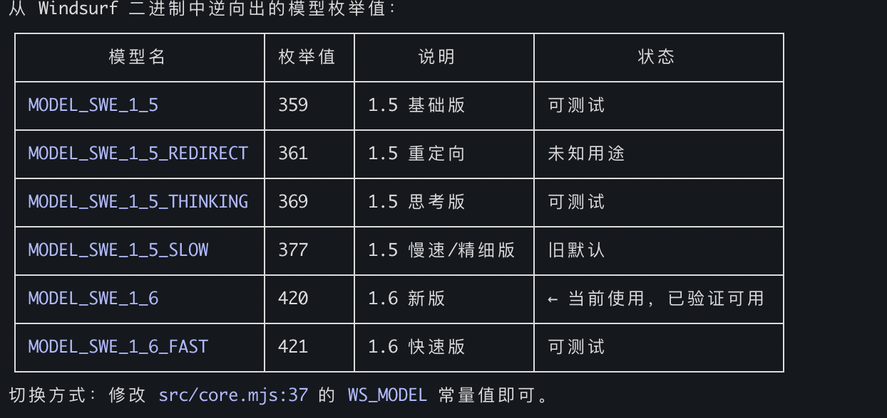

# Fast Context MCP

Multi-backend AI-driven semantic code search as an MCP tool — powered by Windsurf's reverse-engineered SWE-grep protocol (free) and any OpenAI-compatible endpoint.

Any MCP-compatible client (Claude Code, Claude Desktop, Cursor, etc.) can use this to search codebases with natural language queries. All tools are bundled via npm — **no system-level dependencies** needed (ripgrep via `@vscode/ripgrep`, tree via `tree-node-cli`). Works on macOS, Windows, and Linux.

## How It Works

```
You: "where is the authentication logic?"
         │
         ▼
┌─────────────────────────┐
│  Fast Context MCP       │
│  (local MCP server)     │
│                         │
│  1. Maps project → /codebase
│  2. Sends query to Windsurf Devstral API
│  3. AI generates rg/readfile/tree commands
│  4. Executes commands locally (built-in rg)
│  5. Returns results to AI
│  6. Repeats for N rounds
│  7. Returns file paths + line ranges
│     + suggested search keywords
└─────────────────────────┘
         │
         ▼
Found 3 relevant files.
  [1/3] /project/src/auth/handler.py (L10-60)
  [2/3] /project/src/middleware/jwt.py (L1-40)
  [3/3] /project/src/models/user.py (L20-80)

Suggested search keywords:
  authenticate, jwt.*verify, session.*token
```

## Prerequisites

- **Node.js** >= 18
- **Windsurf account** — free tier works (needed for API key)

No need to install ripgrep — it's bundled via `@vscode/ripgrep`.

## Installation

### Option 1: npm (Recommended)

```bash
# Latest stable release
npm install @sammysnake/fast-context-mcp

# Or beta/next release
npm install @sammysnake/fast-context-mcp@next
```

### Option 2: From Source

```bash
git clone https://github.com/SammySnake-d/fast-context-mcp.git
cd fast-context-mcp
npm install
```

## Setup

### 1. Get Your Windsurf/Devin API Key

The server auto-extracts the API key from Devin CLI/Desktop or a legacy Windsurf installation. You can also set `WINDSURF_API_KEY` manually.

Desktop credentials are discovered in this order: `Devin`, legacy `Deviv`, then `Windsurf`.

| Platform | Path |
|----------|------|
| macOS | `~/Library/Application Support/Devin/User/globalStorage/state.vscdb` |
| Windows | `%APPDATA%/Devin/User/globalStorage/state.vscdb` |
| Linux | `~/.config/Devin/User/globalStorage/state.vscdb` |

On WSL/Linux, the server first checks Devin CLI credentials at `~/.local/share/devin/credentials.toml`. If a Windows-extracted key returns 403 inside WSL, run `devin login` inside WSL and retry.

### 2. Configure MCP Client

#### Claude Code

Add to `~/.claude.json` under `mcpServers`:

```json
{
  "fast-context": {
    "command": "npx",
    "args": ["-y", "--prefer-online", "@sammysnake/fast-context-mcp"],
    "env": {
      "WINDSURF_API_KEY": "sk-ws-01-xxxxx"
    }
  }
}
```

For beta/next release:

```json
{
  "fast-context": {
    "command": "npx",
    "args": ["-y", "--prefer-online", "@sammysnake/fast-context-mcp@next"],
    "env": {
      "WINDSURF_API_KEY": "sk-ws-01-xxxxx"
    }
  }
}
```

#### Claude Desktop

Add to `claude_desktop_config.json` under `mcpServers`:

```json
{
  "fast-context": {
    "command": "npx",
    "args": ["-y", "--prefer-online", "@sammysnake/fast-context-mcp"],
    "env": {
      "WINDSURF_API_KEY": "sk-ws-01-xxxxx"
    }
  }
}
```

For beta/next release:

```json
{
  "fast-context": {
    "command": "npx",
    "args": ["-y", "--prefer-online", "@sammysnake/fast-context-mcp@next"],
    "env": {
      "WINDSURF_API_KEY": "sk-ws-01-xxxxx"
    }
  }
}
```

> If `WINDSURF_API_KEY` is omitted, the server auto-discovers it from your local Windsurf installation.

#### Devin Desktop

Add to `devin_mcp_config.json` under `mcpServers`:

```json
{
  "fast-context": {
    "command": "npx",
    "args": ["-y", "--prefer-online", "@sammysnake/fast-context-mcp"],
    "env": {
      "WINDSURF_API_KEY": "sk-ws-01-xxxxx"
    }
  }
}
```

## Environment Variables

| Variable | Default | Description |
|----------|---------|-------------|
| `WINDSURF_API_KEY` | *(auto-discover)* | Windsurf API key |
| `FC_MAX_TURNS` | `3` | Search rounds per query (more = deeper but slower) |
| `FC_MAX_COMMANDS` | `8` | Max parallel commands per round |
| `FC_TIMEOUT_MS` | `30000` | Connect-Timeout-Ms for streaming requests |
| `FC_RESULT_MAX_LINES` | `50` | Max lines per command output (truncation) |
| `FC_LINE_MAX_CHARS` | `250` | Max characters per output line (truncation) |
| `FC_SNIPPET_MAX_LINES` | `200` | Total line budget for returned snippets |
| `WS_MODEL` | `MODEL_SWE_1_6_FAST` | Windsurf model name; set explicitly only when the account supports another model |
| `WS_APP_VER` | `1.48.2` | Windsurf app version (protocol metadata) |
| `WS_LS_VER` | `1.9544.35` | Windsurf language server version (protocol metadata) |
| `DEEPGREP_API_URL` | `https://router.chainlens.net/v1` | OpenAI-compatible API URL for deep search |
| `DEEPGREP_API_KEY` | *(none)* | API key for deep search and OpenAI fast mode |
| `DEEPGREP_MODEL` | `deep-search` | Deep-search model ID |
| `DEEPGREP_FAST_BACKEND` | `windsurf` | Fast backend: `windsurf` or `openai` |
| `DEEPGREP_FAST_MODEL` | *(deep model)* | Model override when fast backend is `openai` |
| `DEEPGREP_CACHE_DISABLED` | *(unset)* | Disable result cache with `1`, `true`, `yes`, or `on` |
| `DEEPGREP_CACHE_TTL_MS` | `300000` | Result-cache TTL; `<=0` disables caching |
| `DEEPGREP_CACHE_MAX_ENTRIES` | `200` | Maximum in-memory cache entries |
| `FC_ALLOW_INSECURE_TLS` | *(unset)* | Set to `1` to disable TLS cert verification (e.g. corporate proxy) |

## Available Models

The model can be changed by setting `WS_MODEL` (see environment variables above).



Default: `MODEL_SWE_1_6_FAST` — the broadly available free-tier model. Accounts with access can select another model through `WS_MODEL`.

## MCP Tools

### `deepgrep_search`

AI-driven semantic code search with tunable parameters.

| Parameter | Type | Required | Default | Description |
|-----------|------|----------|---------|-------------|
| `query` | string | Yes | — | Natural language search query |
| `project_path` | string | No | cwd | Absolute path to project root |
| `tree_depth` | integer | No | `3` | Directory tree depth for repo map (1-6). Higher = more context but larger payload. Auto falls back to lower depth if tree exceeds 250KB. Use 1-2 for huge monorepos (>5000 files), 3 for most projects, 4-6 for small projects. |
| `max_turns` | integer | No | `3` | Search rounds (1-5). More = deeper search but slower. Use 1-2 for simple lookups, 3 for most queries, 4-5 for complex analysis. |
| `max_results` | integer | No | `10` | Maximum number of files to return (1-30). Smaller = more focused, larger = broader exploration. |
| `exclude_paths` | string[] | No | `[]` | Directory/file patterns excluded from search context. |
| `include_snippets` | boolean | No | `false` | Include code snippets for returned line ranges. |
| `auto_escalate` | boolean | No | `true` | Route complex or empty-result searches to deep mode when configured. |

Returns:
1. **Relevant files** with line ranges
2. **Suggested search keywords** (rg patterns used during AI search)
3. **Diagnostic metadata** (`[config]` line showing actual tree_depth used, tree size, and whether fallback occurred)

Example output:
```
Found 3 relevant files.

  [1/3] /project/src/auth/handler.py (L10-60, L120-180)
  [2/3] /project/src/middleware/jwt.py (L1-40)
  [3/3] /project/src/models/user.py (L20-80)

grep keywords: authenticate, jwt.*verify, session.*token

[config] tree_depth=3, tree_size=12.5KB, max_turns=3
```

Error output includes status-specific hints:
```
Error: Request failed: HTTP 403

[hint] 403 Forbidden: Authentication failed. The API key may be expired or revoked.
Run `deepgrep_status` to inspect credential discovery, or set a fresh `WINDSURF_API_KEY`.
If you are running inside WSL, run `devin login` inside WSL so `~/.local/share/devin/credentials.toml` exists.
```

```
Error: Request failed: HTTP 413

[diagnostic] tree_depth_used=3, tree_size=280.0KB (auto fell back from requested depth)
[hint] If the error is payload-related, try a lower tree_depth value.
```

### `deepgrep_deep`

Deep AI-driven semantic code search using an OpenAI-compatible backend. More thorough than `deepgrep_search` but slower (20-40s). Use when fast search returns 0 results or when you need comprehensive cross-file analysis.

| Parameter | Type | Required | Default | Description |
|-----------|------|----------|---------|-------------|
| `query` | string | Yes | — | Natural language search query |
| `project_path` | string | No | cwd | Absolute path to project root |
| `tree_depth` | integer | No | `3` | Directory tree depth (1-6) |
| `max_results` | integer | No | `10` | Maximum files to return (1-30) |
| `exclude_paths` | string[] | No | `[]` | Patterns to exclude |

Requires `DEEPGREP_API_KEY`; endpoint/model are controlled by `DEEPGREP_API_URL` and `DEEPGREP_MODEL`.

### `deepgrep_get`

Reads exact code snippets after search. Paths are confined to `project_path` (default: server cwd).

### `deepgrep_status`

Reports backend configuration, model availability, and Devin/Windsurf credential discovery status.

## Project Structure

```
fast-context-mcp/
├── package.json
├── deepgrep/
│   └── src/
│       ├── server.mjs         # MCP server entry point
│       ├── core.mjs           # Windsurf protocol: auth, streaming, search loop
│       ├── openai-backend.mjs # OpenAI-compatible backend for deep search
│       ├── shared.mjs         # Shared utilities: repo map, prompts, parsers
│       ├── executor.mjs       # Confined rg/readfile/tree/ls/glob executor
│       ├── extract-key.mjs    # Devin/Windsurf credential discovery
│       └── protobuf.mjs       # Protobuf encoder/decoder + Connect-RPC frames
├── test/                 # Unit and MCP stdio integration tests
├── README.md
└── LICENSE
```

## How the Search Works

1. Project directory is mapped to virtual `/codebase` path
2. Directory tree generated at requested depth (default L=3), with **automatic fallback** to lower depth if tree exceeds 250KB
3. Query + directory tree sent to Windsurf's Devstral model via Connect-RPC/Protobuf
4. Devstral generates tool commands (ripgrep, file reads, tree, ls, glob)
5. Commands executed locally in parallel (up to `FC_MAX_COMMANDS` per round)
6. Results sent back to Devstral for the next round
7. After `max_turns` rounds, Devstral returns file paths + line ranges
8. All rg patterns used during search are collected as suggested keywords
9. Diagnostic metadata appended to help the calling AI tune parameters

## Technical Details

- **Protocol**: Connect-RPC over HTTP/1.1, Protobuf encoding, gzip compression
- **Model**: Devstral (`MODEL_SWE_1_6_FAST`, configurable)
- **Local tools**: `rg` (bundled via @vscode/ripgrep), `readfile` (Node.js fs), `tree` (tree-node-cli), `ls` (Node.js fs), `glob` (Node.js fs)
- **Auth**: API Key → JWT (auto-fetched per session)
- **Runtime**: Node.js >= 18 (ESM)

### Dependencies

| Package | Purpose |
|---------|---------|
| `@modelcontextprotocol/sdk` | MCP server framework |
| `@vscode/ripgrep` | Bundled ripgrep binary (cross-platform) |
| `tree-node-cli` | Cross-platform directory tree (replaces system `tree`) |
| `sql.js` | Read Windsurf's local SQLite DB (WASM, no native compile) |
| `zod` (`^3.25.76`) | Schema validation; excludes the incomplete `3.25.0` tarball served by some npm mirrors while retaining Zod 3 compatibility |

## 友情链接

- [LINUX DO](https://linux.do/t/topic/1583790/64)

## License

MIT
